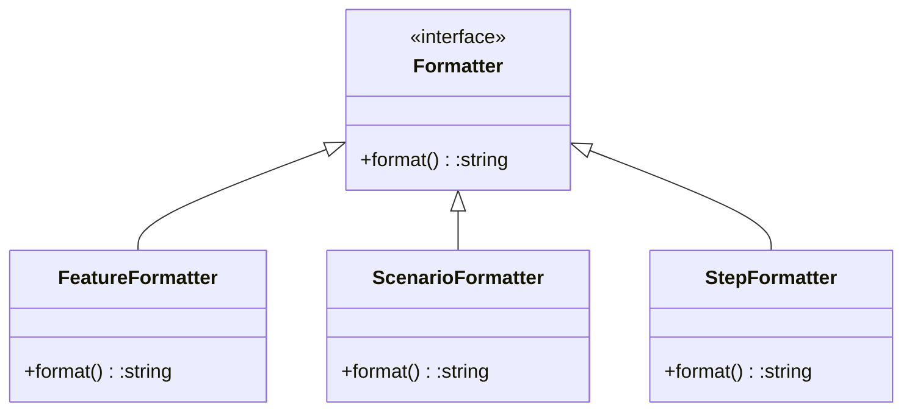

# Mermaid

!!!include(.menu.md)!!!

## Examples

```mermaid
classDiagram
    Formatter <|-- FeatureFormatter
    Formatter <|-- ScenarioFormatter
    Formatter <|-- StepFormatter
    class Formatter{
        <<interface>>
        +format():string
    }
    class FeatureFormatter{
        +format():string
    }
    class ScenarioFormatter{
        +format():string
    }
    class StepFormatter{
        +format():string
    } 
```