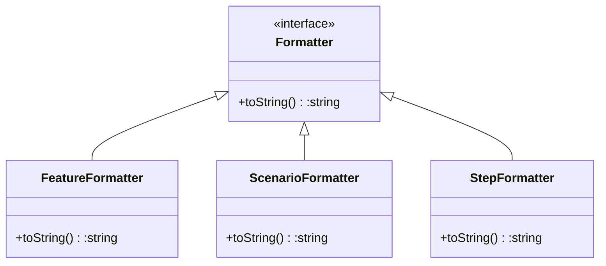
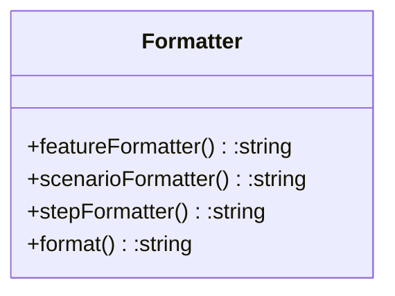
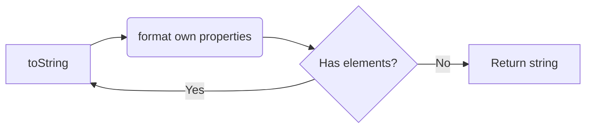
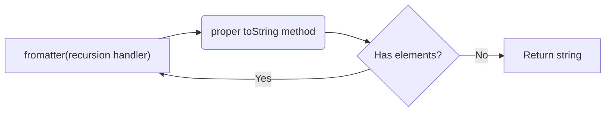

## Examples
Separate formatters
- +Single-responsibility principle
- Separate files
- +Simple to read behaviour of each formatter
- -Harder to read the overall picture

Single class for all type of formatters
- +Easier to read the overal picture
- -Harder to read behaviour of each formatter

toString method handles both recursion and string formatting

toString method only handles string formatting and recursion handling is outsourced to a new method
- more logic introduced
- clean toString methods
