# Mermaid

!!!include(.menu.md)!!!

## Examples
Gherkin Formatter
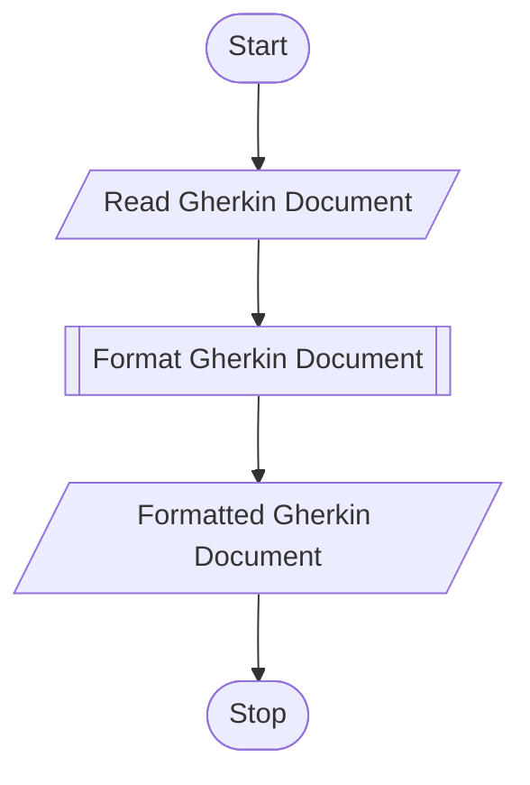
Format Gherkin Document
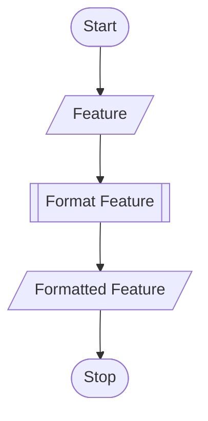

Format Feature
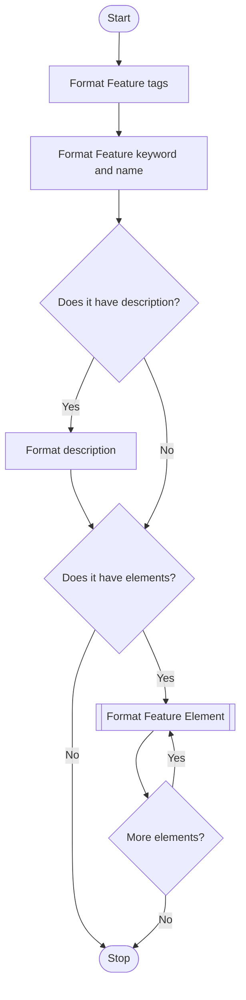

Format Feature Element
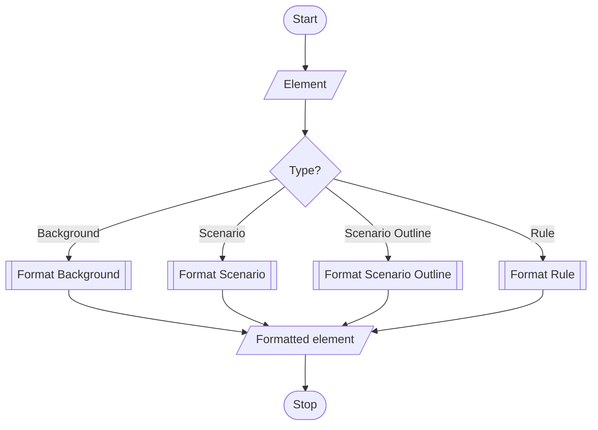

 Format Background
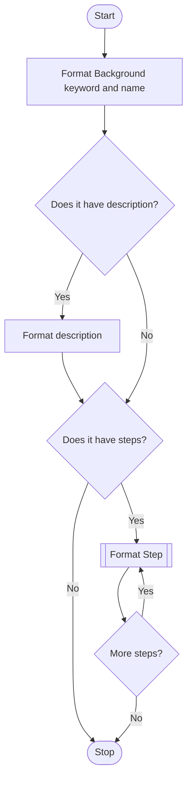
Format Scenario
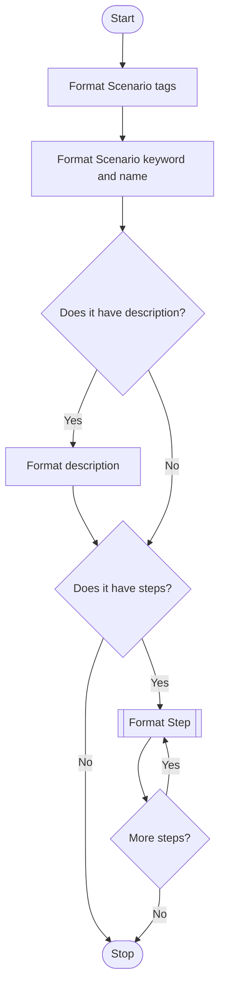
Format Scenario Outline
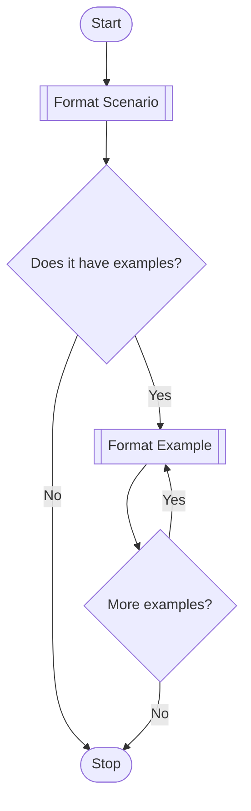
Format Rule
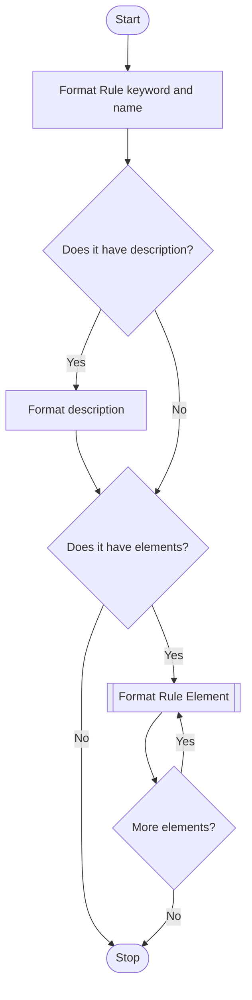

Format Rule Element
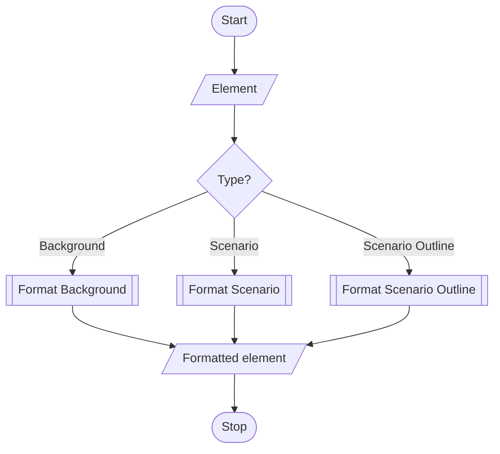

Format Step
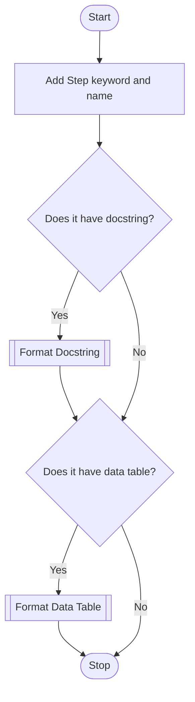

Format Docstring
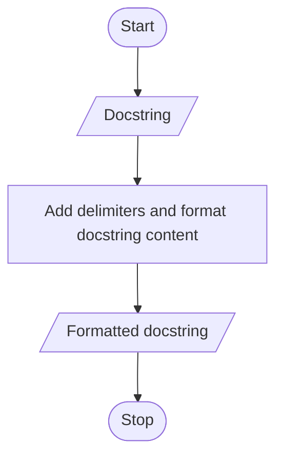

Format Examples
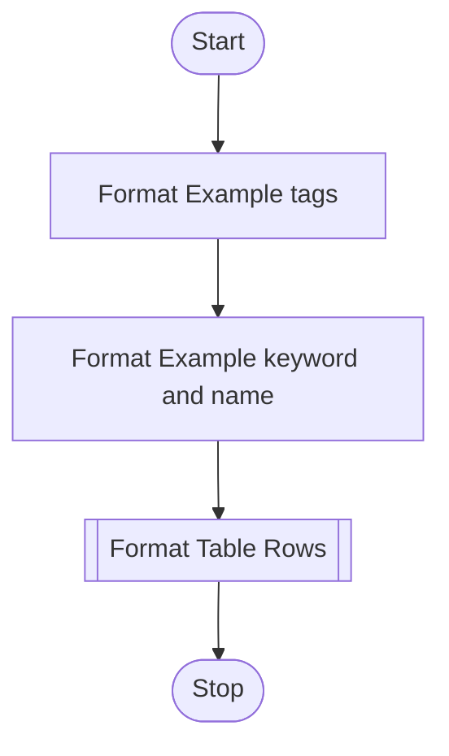

Format Data Table
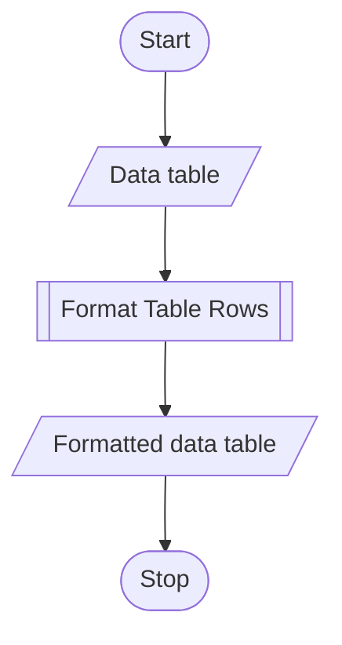

Format Table Rows
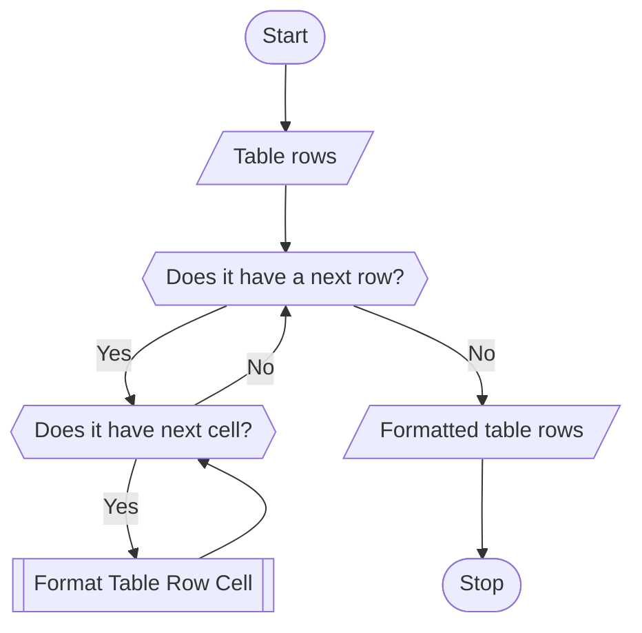

Format Table Row Cell
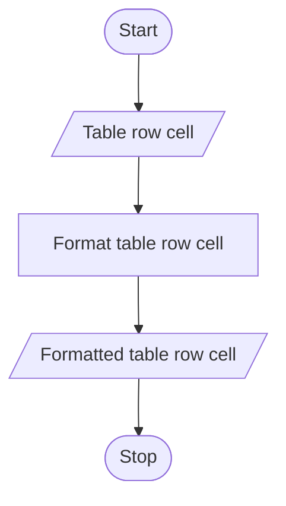