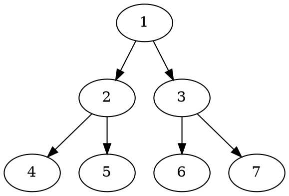

<script src="https://unpkg.com/mermaid@8.5.0/dist/mermaid.min.js"></script>
<script>mermaid.initialize({startOnLoad:true});</script> 

# PreCompiler

## Ditaa

```ditaa
+--------+   +-------+    +-------+
|        +---+ ditaa +--> |       |
|  Text  |   +-------+    |diagram|
|Document|   |!magic!|    |       |
|     {d}|   |       |    |       |
+---+----+   +-------+    +-------+
    :                         ^
    |       Lots of work      |
    +-------------------------+
```

## GraphViz



## PlantUML

```plantuml
Bob -> Alice : hello
```

## Mermain

